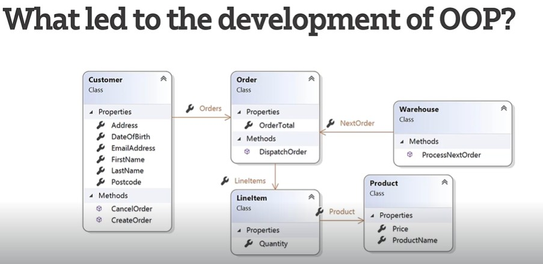
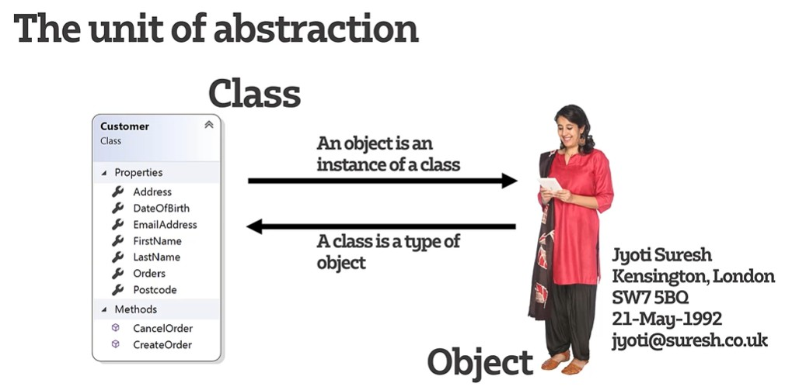

# Object-Oriented Principles

## Explain the motivation for OOP

In the early 20th century there was a clear **separation** between 
- the data that the programs were operating on - stored in relational databases and 
- the code which was operating on that data.

**Problems with Procedural programming**
* *data separated from functions* --> 
* *lack of modularity* --> difficult to create modular entities when the data elements and the programming elements are separated
* *high coupling* --> makes re-use difficult
* *re-use difficult* --> difficult to re-use code if it depends on the structure of particular data
* *not modelling the real world* --> in the real world, we don't encounter data separated from entities that are able to operate on it.

As the 20th century wore on, people began to look for an alternative approach to deal with the above issues. 
One approach that was adopted was **combining** the **data elements** with the **operations** on that data:

That style of programming is known as **Object-Oriented Programming**.
Every entity in this development of programming allows us to combine:
- the **data elements** and 
- the **operational elements** 
into a single unit and that unit is called a **class**. 

Object-Oriented programming languages: Java, Python, C# and C++
Procedural programming language: C.

## Describe the expected benefits of OOP
- data and functions combined in a single unit;
- better modularity, where everything is self-contained - we can take a class from one oop and put it into another one;
- re-use is easier;
- closely modelling of the real world - object contain data and they can do something as well, so closer to reality;
- easier for non-technical people to understand its concepts as it's close to the spoken language.

## State the four main principles of OOP

### Abstraction

#### Explain the principle of abstraction
When we describe something in an abstract way - i.e. "I've got a car" - you can imagine a picture of what that means 
and have a logical, shared understanding of what the elements are that would make up a car.
We have a term, which could mean quite a range of things, but we have some kind of common criteria which would represent that.

#### Give an example of abstraction in the real world
- a car: wheels, headlights, engine, doors, seats, steering wheel,operations - start, stop, accelerate, break, turn, etc.
- a bag: colour, handles, size, material, pocket; operations - put things in, take things out, close it, open it, etc.

#### Understand how abstraction applies to programming
We use classes to represent abstraction. The unit we have for abstraction is called a **class**.

Classes contain:
- *name of the class*;
- *properties* = elements of data, which are real values at the time we create an object of that class;
- *methods/functions* = operations the class performs.

An **object** is an **instance of a class**.

A **class** is a **type of object**.

### Encapsulation

### Inheritance

### Polymorphism

